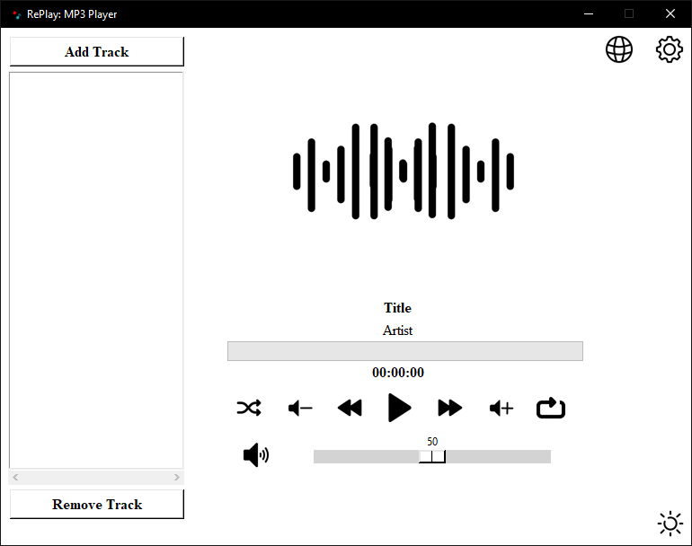
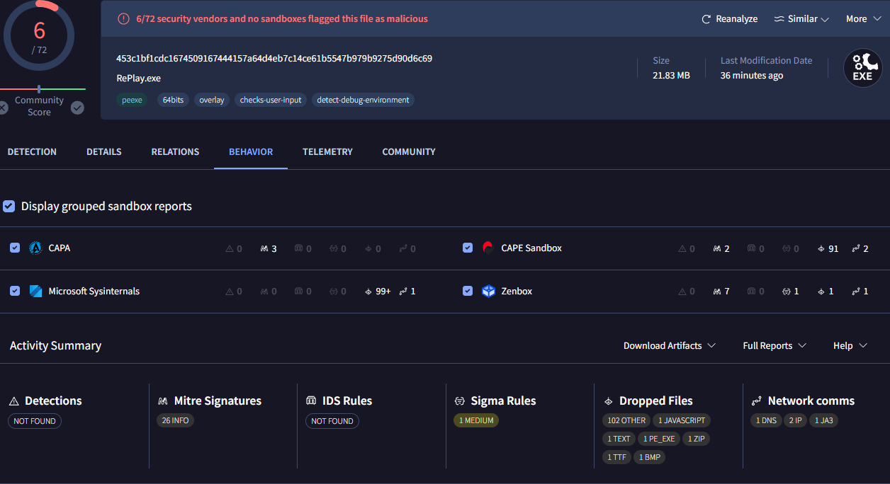

# RePlay: MP3 Player



## Overview

RePlay is an MP3 player GUI built on Tkinter. It offers features such as theme toggling, playlist management, and audio playback control. Built with Python, it leverages the power of libraries such as Tkinter for the GUI, Pygame for audio handling, Pillow for image processing, and TinyTag for metadata extraction. Compiled with the help of [Auto PY to EXE.](https://github.com/brentvollebregt/auto-py-to-exe)

## Features

- **Theme Customization**: Users can switch between light and dark themes to suit their preferences.
- **Playlist Management**: Add, remove, and shuffle tracks in your playlist.
- **Audio Playback Control**: Supports different repeat modes, basic playback control, and volume control functionalities.
- **Audio Progress Tracking**: Displays the current track's progress and allows users to jump to different parts of the track.
- **Artwork Display**: Shows the artwork of the currently playing track if available.

## Installation

To modify the source code of RePlay, follow these steps:

1. **Install Python**: Ensure you have Python 3.11+ installed on your system. You can download it from the [official Python website](https://www.python.org/downloads/).

2. **Clone the Repository**: Clone this repository to your local machine using Git.

   ```
   git clone https://github.com/rxality/RePlay.git
   ```

3. **Install Dependencies**: Navigate to the cloned repository's directory and install the required dependencies using pip and the `requirements.txt` file.

   ```
   cd RePlay
   pip install -r requirements.txt
   ```

*Note: `start.bat` and `start.sh` included to allow easy installing and running. Optional.*

## Dependencies

The application requires the following Python modules:

- **[TinyTag](https://github.com/devsnd/tinytag)**: Reading audio metadata.
- **[Pillow](https://github.com/python-pillow/Pillow)**: Handle and manipulate images.
- **[Pygame](https://github.com/pygame/pygame)**: Handling audio playback.

These dependencies will be automatically installed when you run the `pip install -r requirements.txt` command.

## VirusTotal

The program may raise false positives when extracting and flag it as a virus. Feel free to view the [VirusTotal Scan Results.](https://www.virustotal.com/gui/file/453c1bf1cdc1674509167444157a64d4eb7c14ce61b5547b979b9275d90d6c69)



- Algorithm
    - SHA256

- Hash
    - 453C1BF1CDC1674509167444157A64D4EB7C14CE61B5547B979B9275D90D6C69

If you want to validate the authenticity of the file, you can do so on your system or online by uploading the `RePlay.exe` file to [VirusTotal.](https://www.virustotal.com/gui/home/upload)

- Windows
    - `get-filehash RePlay.exe`

- Linux
    - `sha256sum RePlay.exe`

- Mac
    - `shasum -a 256 RePlay.exe`

## Compatibility

- Windows 10/11
- Linux
- Mac (untested)
- Python 3.8+

RePlay MP3 Player is developed and tested on Windows with Python 3.11. While it may work on Mac and Linux, these platforms are untested, and compatibility cannot be guaranteed. The application is expected to work with versions of Python before or after 3.11, but this has not been extensively tested.

## License

This project is licensed under the GNU General Public License version 3 (GPL-3.0). For more information, see the [LICENSE](LICENSE) file in this repository or visit the [GNU General Public License version 3](https://www.gnu.org/licenses/gpl-3.0.en.html) webpage.
---